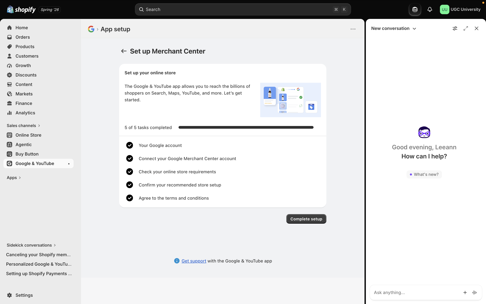
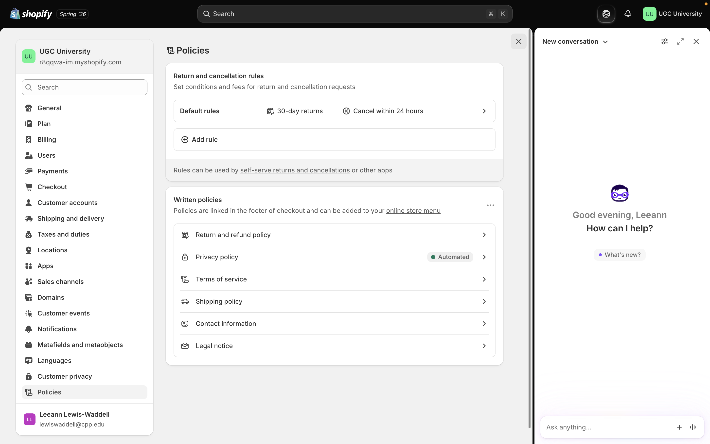
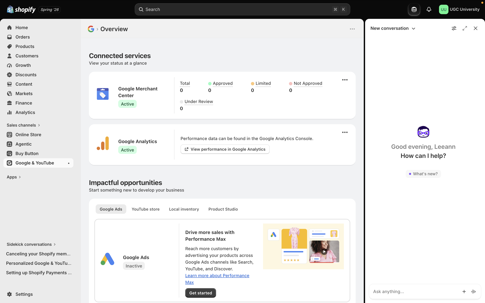
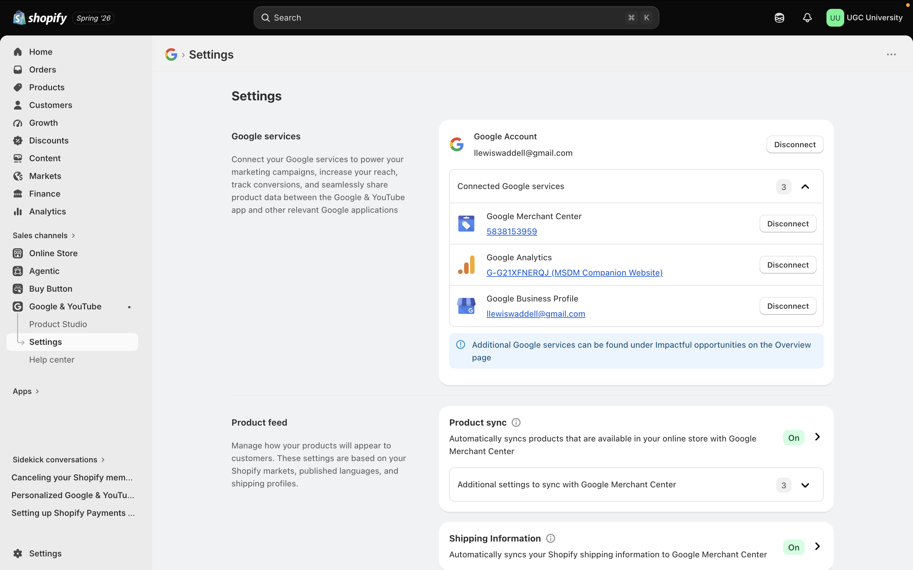
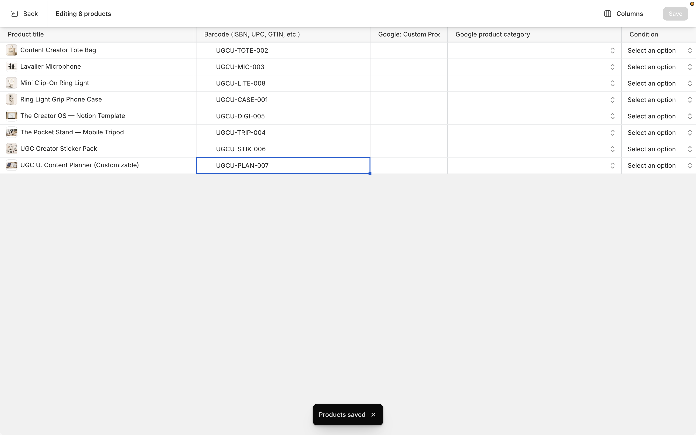
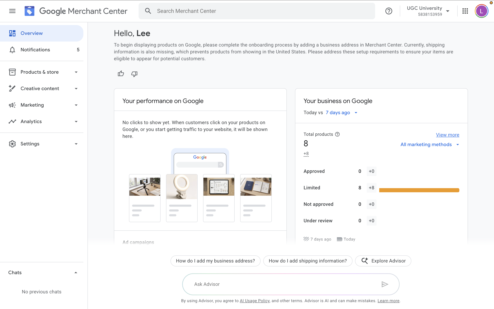
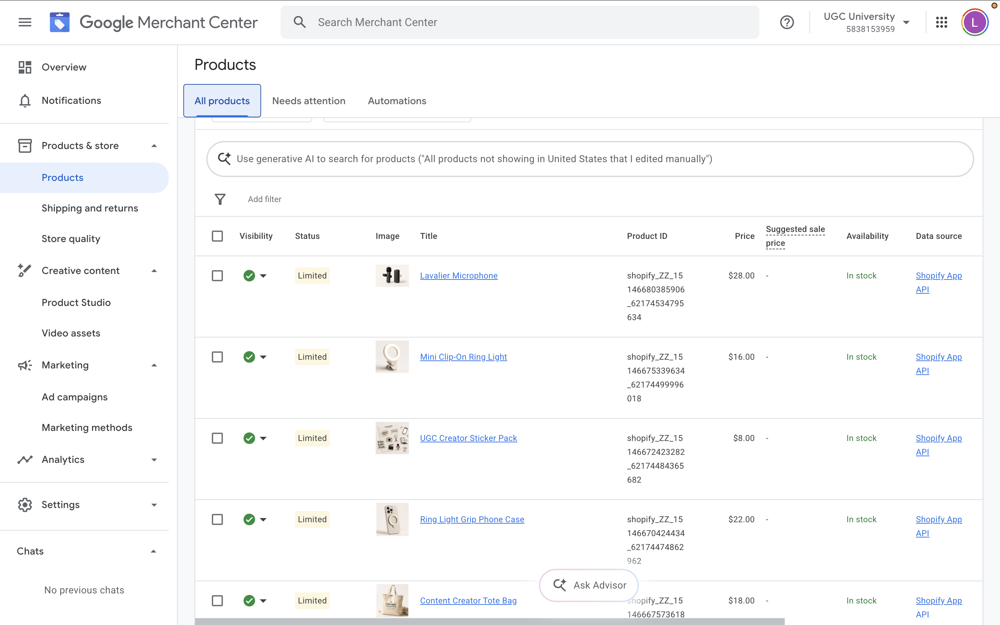
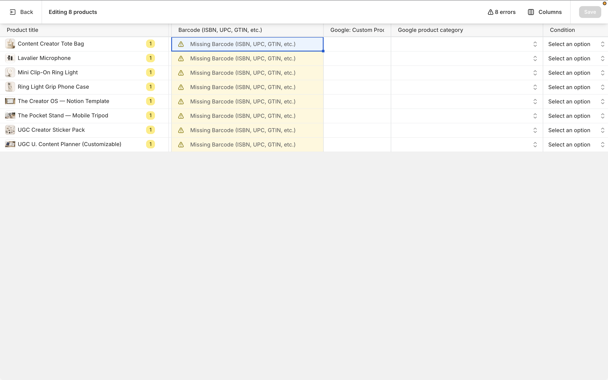
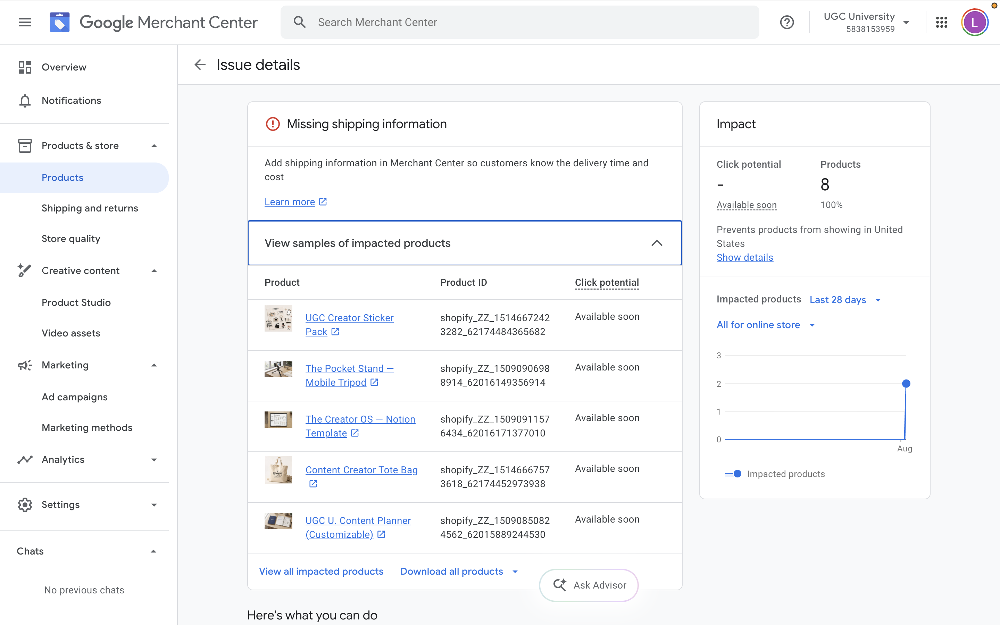
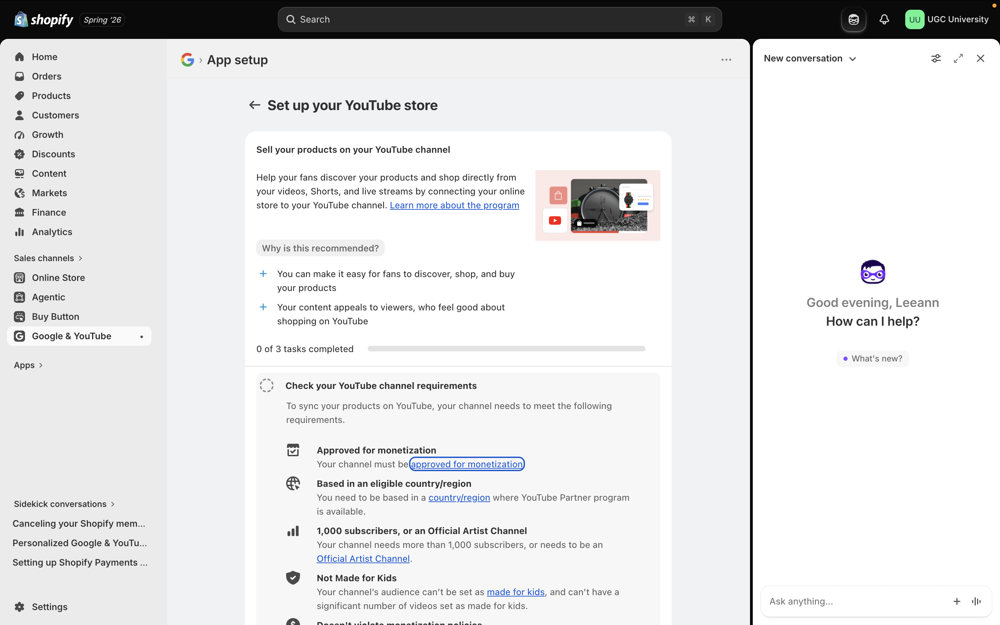

# **Introduction**

**UGC University** is a Shopify practice store built to simulate an e-commerce business serving content creators. The store sells a curated catalog of eight products organized into three collections: Creator Essentials, Equipment, and Digital Products. Creator Essentials includes everyday branded items such as a tote bag and sticker pack, used to test a print *on-demand* fulfillment model. Equipment features filming gear, including a ring light grip phone case, lavalier microphone, mini clip on ring light, and mobile tripod, used to test a *dropshipping* fulfillment model. Digital Products includes a Notion template and a customizable content planner, used to test a *digital product* fulfillment model that requires no shipping or physical inventory.

The store's assortment reflects the full workflow of a content creator, from everyday identity building items to production gear to business management tools, while also allowing the store to demonstrate three distinct fulfillment models within a single storefront.

# **Connection Attempt Evidence**

# **Product Sync or Product Listing Evidence**

# **Setup Barriers and Warnings**

{alt="Blocker 1: Missing Product ISBNs"}

{alt="Unable to Setup Youtube Sales Channel"}

## Setup Barrier Explanation

Two main barriers appeared during setup. All 8 products showed a "Missing Barcode (ISBN, UPC, GTIN, etc.)" warning in Shopify's bulk editor, resulting in 8 errors that had to be resolved by adding SKU identifiers before the listings could sync properly.

Google Merchant Center flagged missing business address and shipping information at the account level, which kept all 8 products in Limited status rather than Approved. The issue details page confirmed this was a "Missing shipping information" error affecting all products, preventing them from showing to customers in the United States despite syncing successfully from Shopify.

Another barrier encountered was the inability to enable YouTube product syncing. Google requires a channel to be approved for monetization and to have over 1,000 subscribers before products can be linked to videos or Shorts, and the connected channel did not meet this requirement, leaving YouTube setup at 0 of 3 tasks completed.

# **Fixes Needed**

Before UGC University could realistically use Google Merchant Center, several issues would need to be resolved. Even though all eight products were initially missing barcode information, shown as required GTIN or UPC fields in the product data editor, the Merchant Center account still needs a business address added. As such, this was flagged as missing and prevents products from being eligible to appear for customers in the United States. Even after shipping information was enabled and synced from Shopify, all eight products remained in Limited status rather than Approved, meaning they were not yet appearing in Google search results, so these outstanding issues would need to be fully resolved before products could move to an approved and visible state.

To unlock YouTube product syncing, the connected channel would need to grow past 1,000 subscribers or become approved for monetization, which is a longer term fix tied to audience growth rather than a technical setting.

# **CPP Farm Store Reflection**

Setting up Google Merchant Center for UGC University highlights several lessons that apply directly to the CPP Farm Store. Most prevalent was missing product identifiers, since Google requires barcode or GTIN information before any listing can be approved. The Farm Store would likely encounter the same issue, since bundled or custom gift baskets do not come with manufacturer barcodes the way a standard retail product would. This means the product feed would need internal SKUs or staff would need to mark products as GTIN exempt early in the process to avoid stalling the entire product feed.

The missing business address and shipping information requirement is another important takeaway, since Google will not display products to customers until this foundational account information is fully complete. For a business like the Farm Store that is transitioning from an in person, phone based ordering model to a true online storefront, these administrative details are easy to overlook, even though Google will not approve products without them. This points to a broader lesson: successful digitization depends less on creative product presentation and more on getting basic operational data, addresses, shipping details, and identifiers, fully documented from the start.

The YouTube eligibility barrier showed that not every sales channel is equally accessible right away. Because YouTube Shopping requires a subscriber threshold that takes time to build, the Farm Store should prioritize getting Google Shopping fully approved first, since it depends on account and product data rather than audience size.

A smooth Merchant Center rollout depends on solid groundwork, complete data, verified account details, and realistic channel expectations, before real visibility on Google becomes possible.

# Appendix

-   [GitHub Repo](https://github.com/lewiswaddell/OACP-W06.git)

-   [GitHub Pages](https://lewiswaddell.github.io/OACP-W06/)
